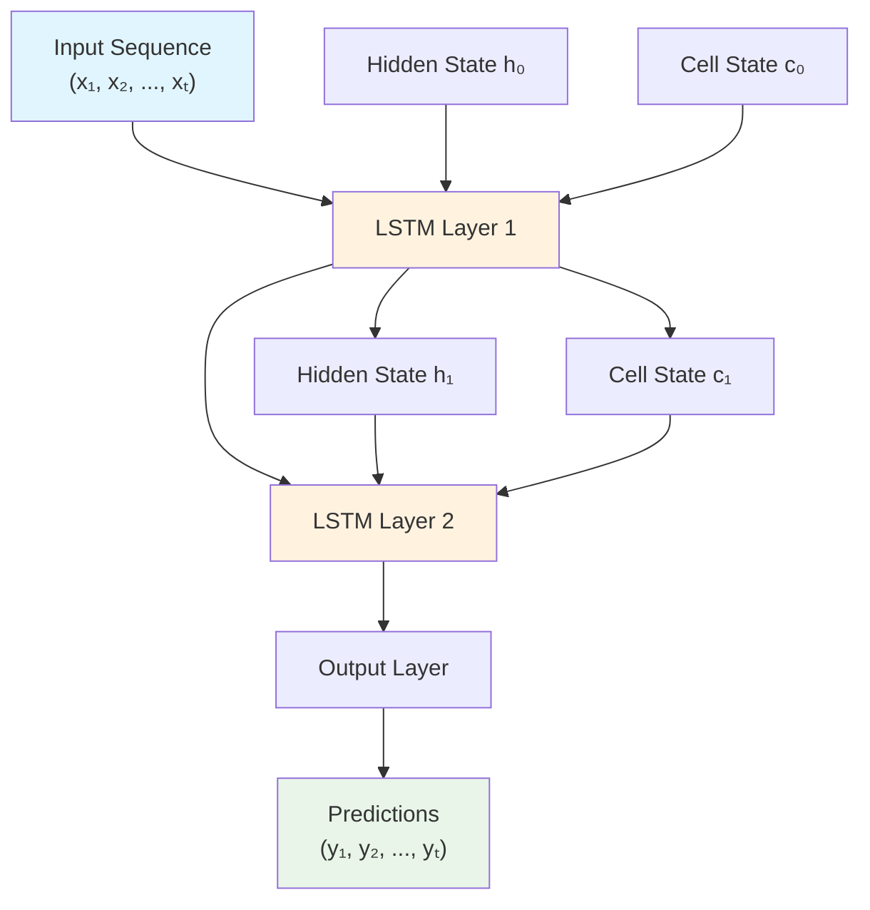
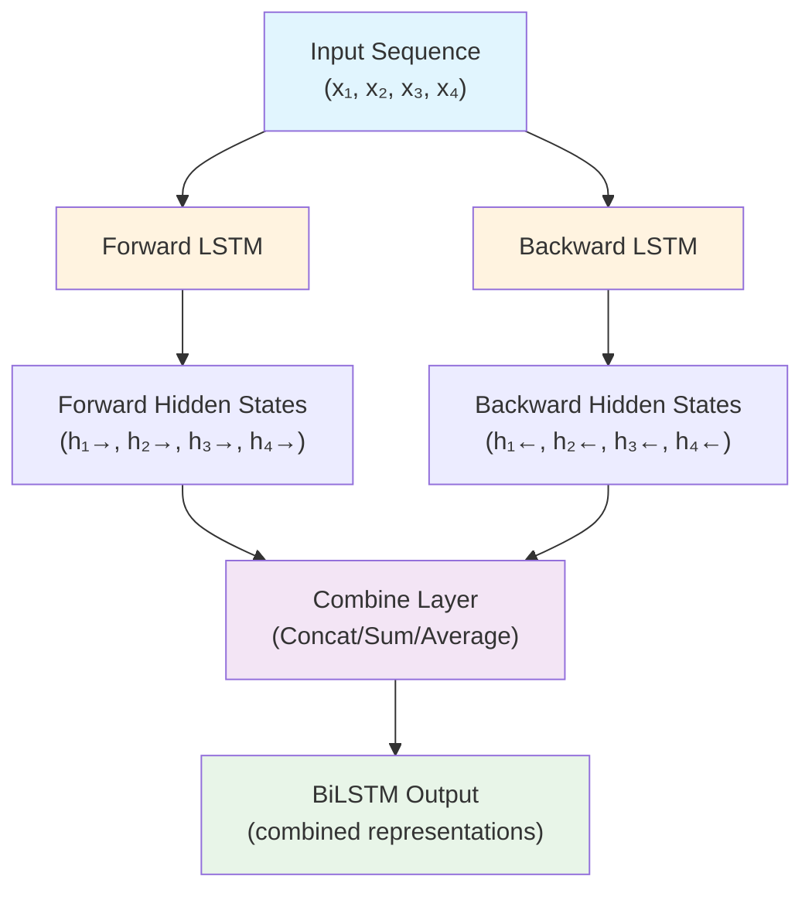
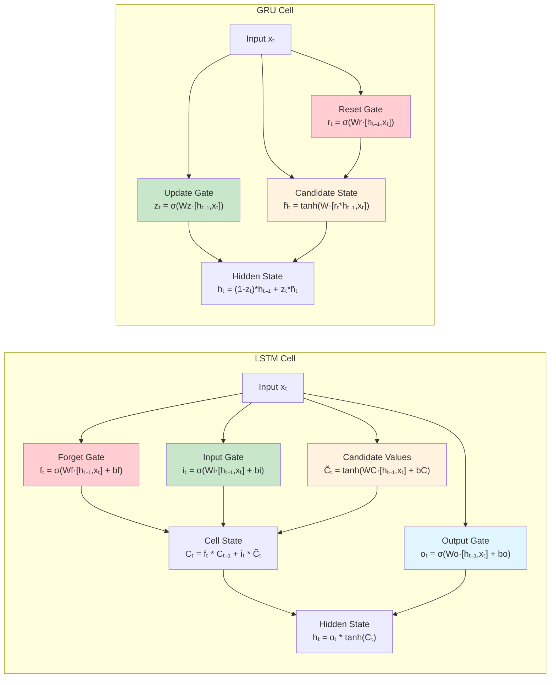

# Rust-LSTM

[](https://crates.io/crates/rust-lstm)
[](https://docs.rs/rust-lstm)
[](https://opensource.org/licenses/MIT)
[](https://www.rust-lang.org)

A comprehensive LSTM (Long Short-Term Memory) neural network library implemented in Rust with complete training capabilities, multiple optimizers, and advanced regularization.

## Network Architecture Overview



## Features

- **LSTM, BiLSTM & GRU Networks** with multi-layer support
- **Linear (Dense) Layer** for classification and output projection
- **Complete Training System** with backpropagation through time (BPTT)
- **Multiple Optimizers**: SGD, Adam, RMSprop with learning rate scheduling
- **Learning Rate Scheduling**: 12 schedulers including OneCycle, Warmup, Cyclical, Polynomial
- **Early Stopping**: Configurable patience and metric monitoring
- **Loss Functions**: MSE, MAE, Cross-entropy with softmax
- **Advanced Dropout**: Input, recurrent, output, variational dropout, and zoneout
- **Batch Processing**: Efficient batch operations
- **Model Persistence**: Save/load models in JSON or binary format
- **Peephole LSTM variant** for enhanced performance

## Quick Start

Add to your `Cargo.toml`:

```toml
[dependencies]
rust-lstm = "0.6"
```

### Basic Usage

```rust
use ndarray::Array2;
use rust_lstm::models::lstm_network::LSTMNetwork;

fn main() {
    // Create LSTM network
    let mut network = LSTMNetwork::new(3, 10, 2); // input_size, hidden_size, num_layers
    
    // Create input data
    let input = Array2::from_shape_vec((3, 1), vec![0.5, 0.1, -0.3]).unwrap();
    let hx = Array2::zeros((10, 1));
    let cx = Array2::zeros((10, 1));
    
    // Forward pass
    let (output, _) = network.forward(&input, &hx, &cx);
    println!("Output: {:?}", output);
}
```

### Training Example

```rust
use rust_lstm::{LSTMNetwork, create_basic_trainer, TrainingConfig};

fn main() {
    // Create network with dropout
    let network = LSTMNetwork::new(1, 10, 2)
        .with_input_dropout(0.2, true)
        .with_recurrent_dropout(0.3, true);
    
    // Setup trainer (uses SGD optimizer and MSE loss by default)
    let mut trainer = create_basic_trainer(network, 0.001)
        .with_config(TrainingConfig {
            epochs: 100,
            clip_gradient: Some(1.0),
            ..Default::default()
        });
    
    // Train (train_data is slice of (input_sequence, target_sequence) tuples)
    // Each input_sequence and target_sequence is Vec<Array2<f64>>
    trainer.train(&train_data, Some(&validation_data));
}
```

### Early Stopping

```rust
use rust_lstm::{
    LSTMNetwork, create_basic_trainer, TrainingConfig, 
    EarlyStoppingConfig, EarlyStoppingMetric
};

fn main() {
    let network = LSTMNetwork::new(1, 10, 2);
    
    // Configure early stopping
    let early_stopping = EarlyStoppingConfig {
        patience: 10,           // Stop after 10 epochs with no improvement
        min_delta: 1e-4,        // Minimum improvement threshold
        restore_best_weights: true,  // Restore best weights when stopping
        monitor: EarlyStoppingMetric::ValidationLoss,  // Monitor validation loss
    };
    
    let config = TrainingConfig {
        epochs: 1000,  // Will likely stop early
        early_stopping: Some(early_stopping),
        ..Default::default()
    };
    
    let mut trainer = create_basic_trainer(network, 0.001)
        .with_config(config);
    
    // Training will stop early if validation loss stops improving
    trainer.train(&train_data, Some(&validation_data));
}
```

### Bidirectional LSTM

```rust
use rust_lstm::layers::bilstm_network::{BiLSTMNetwork, CombineMode};

// BiLSTM with concatenated outputs (output_size = 2 * hidden_size)
let mut bilstm = BiLSTMNetwork::new_concat(input_size, hidden_size, num_layers);

// Process sequence with both past and future context
let outputs = bilstm.forward_sequence(&sequence);
```

#### BiLSTM Architecture



### GRU Networks

```rust
use rust_lstm::models::gru_network::GRUNetwork;

// Create GRU network (alternative to LSTM)
let mut gru = GRUNetwork::new(input_size, hidden_size, num_layers)
    .with_input_dropout(0.2, true)
    .with_recurrent_dropout(0.3, true);

// Forward pass
let (output, _) = gru.forward(&input, &hidden_state);
```

### Linear Layer

```rust
use rust_lstm::layers::linear::LinearLayer;
use rust_lstm::optimizers::Adam;

// Create linear layer for classification: hidden_size -> num_classes
let mut classifier = LinearLayer::new(hidden_size, num_classes);
let mut optimizer = Adam::new(0.001);

// Forward pass
let logits = classifier.forward(&lstm_output);

// Backward pass
let (gradients, input_grad) = classifier.backward(&grad_output);
classifier.update_parameters(&gradients, &mut optimizer, "classifier");
```

#### LSTM vs GRU Cell Comparison



### Advanced Learning Rate Scheduling

The library includes 12 different learning rate schedulers with visualization capabilities:

```rust
use rust_lstm::{
    LSTMNetwork, create_step_lr_trainer, create_one_cycle_trainer, create_cosine_annealing_trainer,
    ScheduledOptimizer, PolynomialLR, CyclicalLR, WarmupScheduler,
    LRScheduleVisualizer, Adam
};

// Create a network
let network = LSTMNetwork::new(1, 10, 2);

// Step decay: reduce LR by 50% every 10 epochs
let mut trainer = create_step_lr_trainer(network, 0.01, 10, 0.5);

// OneCycle policy for modern deep learning
let mut trainer = create_one_cycle_trainer(network.clone(), 0.1, 100);

// Cosine annealing with warm restarts
let mut trainer = create_cosine_annealing_trainer(network.clone(), 0.01, 20, 1e-6);

// Advanced combinations - Warmup + Cyclical scheduling
let base_scheduler = CyclicalLR::new(0.001, 0.01, 10);
let warmup_scheduler = WarmupScheduler::new(5, base_scheduler, 0.0001);
let optimizer = ScheduledOptimizer::new(Adam::new(0.01), warmup_scheduler, 0.01);

// Polynomial decay with visualization
let poly_scheduler = PolynomialLR::new(100, 2.0, 0.001);
LRScheduleVisualizer::print_schedule(poly_scheduler, 0.01, 100, 60, 10);
```

#### Available Schedulers:
- **ConstantLR**: No scheduling (baseline)
- **StepLR**: Step decay at regular intervals
- **MultiStepLR**: Multi-step decay at specific milestones
- **ExponentialLR**: Exponential decay each epoch
- **CosineAnnealingLR**: Smooth cosine oscillation
- **CosineAnnealingWarmRestarts**: Cosine with periodic restarts
- **OneCycleLR**: One cycle policy for super-convergence
- **ReduceLROnPlateau**: Adaptive reduction on validation plateaus
- **LinearLR**: Linear interpolation between rates
- **PolynomialLR**: Polynomial decay with configurable power
- **CyclicalLR**: Triangular, triangular2, and exponential range modes
- **WarmupScheduler**: Gradual warmup wrapper for any base scheduler

## Architecture

- **`layers`**: LSTM cells, GRU cells, Linear (dense) layer, dropout, peephole LSTM, bidirectional LSTM
- **`models`**: High-level network architectures (LSTM, BiLSTM, GRU)
- **`training`**: Training utilities with automatic train/eval mode switching
- **`optimizers`**: SGD, Adam, RMSprop with scheduling
- **`loss`**: MSE, MAE, Cross-entropy loss functions
- **`schedulers`**: Learning rate scheduling algorithms

## Examples

Run examples to see the library in action:

```bash
# Basic usage and training
cargo run --example basic_usage
cargo run --example training_example
cargo run --example multi_layer_lstm
cargo run --example time_series_prediction

# Advanced architectures
cargo run --example gru_example              # GRU vs LSTM comparison
cargo run --example bilstm_example           # Bidirectional LSTM
cargo run --example dropout_example          # Dropout regularization
cargo run --example linear_layer_example     # Linear layer for classification

# Learning and scheduling
cargo run --example learning_rate_scheduling    # Basic schedulers
cargo run --example advanced_lr_scheduling      # Advanced schedulers with visualization
cargo run --example early_stopping_example      # Early stopping demonstration

# Performance and batch processing
cargo run --example batch_processing_example    # Batch processing with performance benchmarks

# Real-world applications
cargo run --example stock_prediction
cargo run --example weather_prediction
cargo run --example text_classification_bilstm
cargo run --example text_generation_advanced
cargo run --example real_data_example

# Analysis and debugging
cargo run --example model_inspection
```

## Advanced Features

### Dropout Types
- **Input Dropout**: Applied to inputs before computing gates
- **Recurrent Dropout**: Applied to hidden states with variational support
- **Output Dropout**: Applied to layer outputs
- **Zoneout**: RNN-specific regularization preserving previous states

### Optimizers
- **SGD**: Stochastic gradient descent with momentum
- **Adam**: Adaptive moment estimation with bias correction
- **RMSprop**: Root mean square propagation

### Loss Functions  
- **MSELoss**: Mean squared error for regression
- **MAELoss**: Mean absolute error for robust regression
- **CrossEntropyLoss**: Numerically stable softmax cross-entropy for classification

### Learning Rate Schedulers
- **StepLR**: Decay by factor every N epochs
- **OneCycleLR**: One cycle policy (warmup + annealing)
- **CosineAnnealingLR**: Smooth cosine oscillation with warm restarts
- **ReduceLROnPlateau**: Reduce when validation loss plateaus
- **PolynomialLR**: Polynomial decay with configurable power
- **CyclicalLR**: Triangular oscillation with multiple modes
- **WarmupScheduler**: Gradual increase wrapper for any scheduler
- **LinearLR**: Linear interpolation between learning rates

## Testing

```bash
cargo test
```

## Version History

- **v0.6.1**: Fixed text generation in advanced example
- **v0.6.0**: Early stopping support with configurable patience and metric monitoring
- **v0.5.0**: Model persistence (JSON/binary), batch processing
- **v0.4.0**: Advanced learning rate scheduling (12 schedulers), warmup, cyclical LR, visualization
- **v0.3.0**: Bidirectional LSTM networks with flexible combine modes
- **v0.2.0**: Complete training system with BPTT and comprehensive dropout
- **v0.1.0**: Initial LSTM implementation with forward pass

## Contributing

Contributions are welcome! Please submit issues, feature requests, or pull requests.

## License

MIT License - see the LICENSE file for details.
